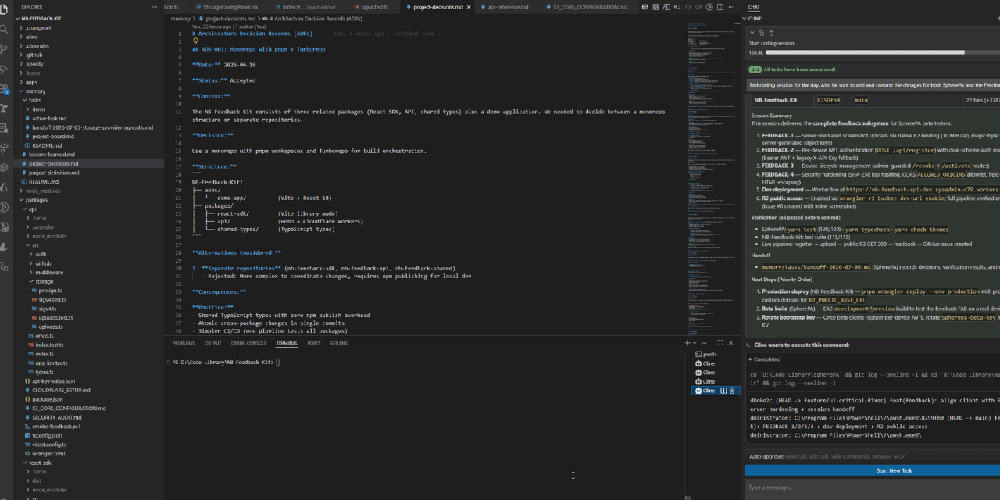
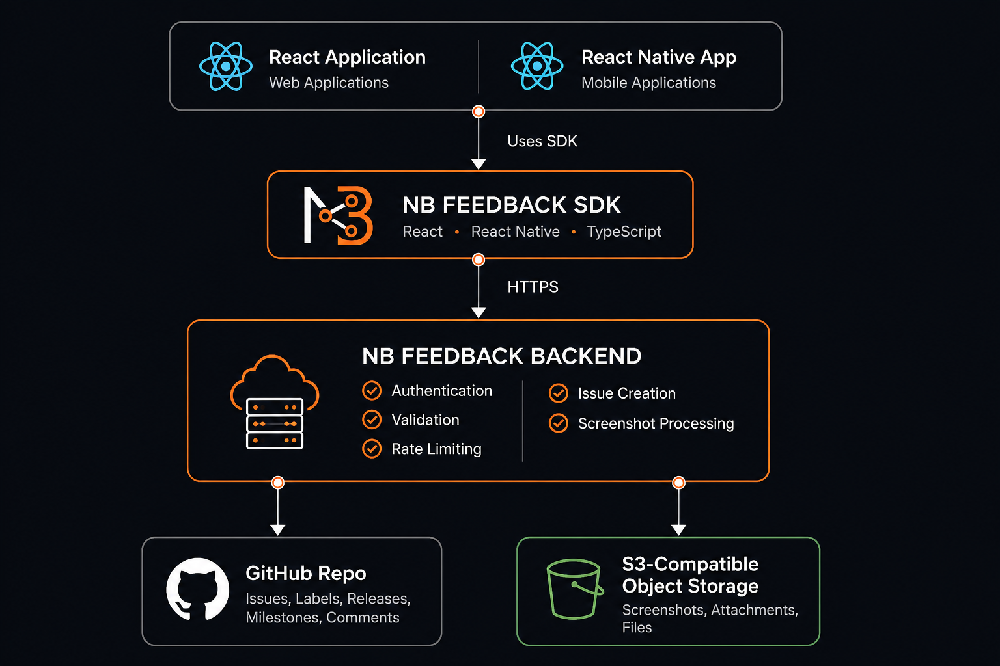
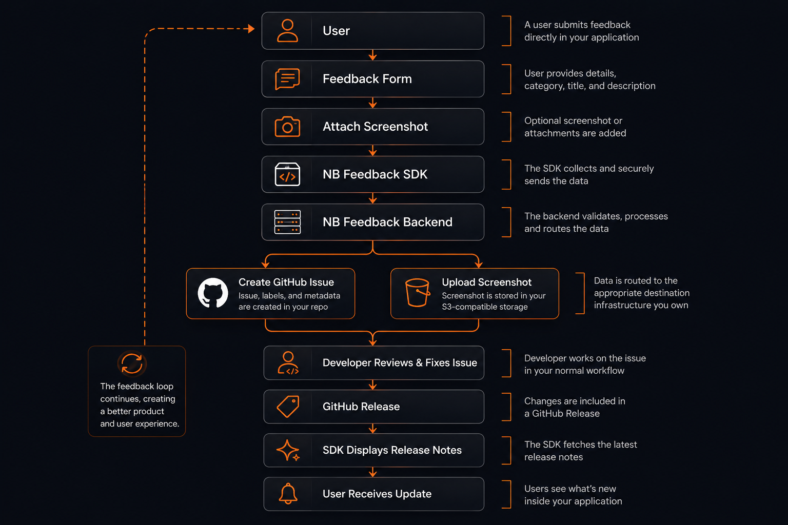
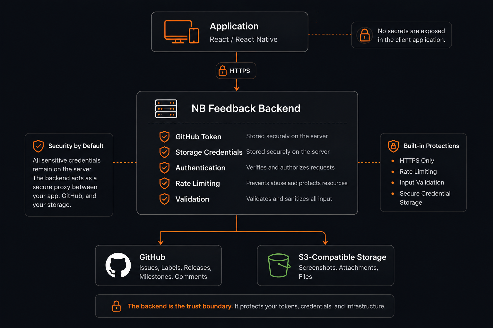
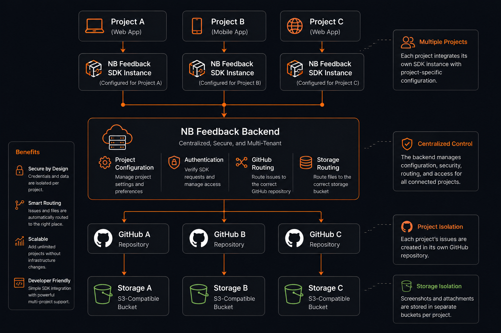

<div align="center">



# NB Feedback Kit

**Secure, GitHub-native feedback infrastructure for React & React Native.**

Collect in-app feedback, screenshots, issues, roadmaps, and release notes —
using *your* GitHub, *your* storage, and *your* infrastructure.

[![License: MIT][license]](LICENSE)
[![Latest Release][release]](https://github.com/Nealsch/NB-Feedback-Kit/releases/latest)
[![GitHub Stars][stars]](https://github.com/Nealsch/NB-Feedback-Kit/stargazers)
[![Forks][forks]](https://github.com/Nealsch/NB-Feedback-Kit/network/members)

[![npm version][npm]](https://www.npmjs.com/package/@nb-feedback-kit/react-sdk)
[![Downloads][downloads]](https://www.npmjs.com/package/@nb-feedback-kit/react-sdk)
[![TypeScript][ts]](https://www.typescriptlang.org/)
[![React][react]](https://react.dev/)
[![React Native][rn]](https://reactnative.dev/)
[![Build Status][build]](https://github.com/Nealsch/NB-Feedback-Kit/actions/workflows/ci.yml)

</div>

---

<p align="center">
  <a href="#why-nb-feedback-kit"><strong>Why</strong></a> &nbsp;·&nbsp;
  <a href="#architecture"><strong>Architecture</strong></a> &nbsp;·&nbsp;
  <a href="#features"><strong>Features</strong></a> &nbsp;·&nbsp;
  <a href="#quick-start"><strong>Quick Start</strong></a> &nbsp;·&nbsp;
  <a href="#documentation"><strong>Docs</strong></a> &nbsp;·&nbsp;
  <a href="CONTRIBUTING.md"><strong>Contribute</strong></a>
</p>

---

> **Own your feedback.**
>
> **Your GitHub. Your storage. Your infrastructure. No vendor lock-in.**

---

## Why NB Feedback Kit?

Most feedback platforms demand another SaaS account, another dashboard, and another database — then duplicate the workflow your team already runs in GitHub.

**NB Feedback Kit takes a different path.** It lets developers collect feedback using the infrastructure they already own.

-  &nbsp;**GitHub-native** — feedback becomes GitHub Issues, releases, and labels.
-  &nbsp;**Your repository** — GitHub stays the single source of truth.
-  &nbsp;**Your storage** — screenshots live in your own S3-compatible bucket.
-  &nbsp;**Your infrastructure** — the backend runs where you run it.
-  &nbsp;**No vendor lock-in** — open source, self-hosted, portable.

| Capability |  &nbsp;NB Feedback Kit | Hosted SaaS | DIY build |
|---|:--:|:--:|:--:|
| GitHub-native |  | — | — |
| Own your storage |  | — |  |
| Self-hosted |  | — |  |
| Vendor neutral |  | — |  |
| Setup in minutes |  |  | — |
| No per-seat pricing |  | — |  |

---

## Architecture

<p align="center">
  
</p>

NB Feedback Kit is a thin **bridge**, not a replacement for your tools.

1. **Your app** (React or React Native) embeds the SDK.
2. The **SDK** talks only to your **NB Feedback backend**.
3. The backend creates **GitHub Issues** and reads Releases, labels, and milestones for the roadmap.
4. Screenshots are streamed to **your S3-compatible object storage**.

Credentials for GitHub and storage never leave the backend, and the client is never trusted with them.

---

## Features

| | Feature | Description |
|:--:|---|---|
|  | **GitHub-native** | Feedback becomes GitHub Issues. Releases, labels, and milestones stay where your team already works. |
|  | **Screenshot Uploads** | Users attach screenshots stored directly in your own S3-compatible bucket. |
|  | **Release Notes** | Surface changelogs from GitHub Releases inside your app, automatically. |
|  | **Roadmap** | Render a public roadmap driven by GitHub labels and milestones. |
|  | **S3-compatible Storage** | Bring Amazon S3, Cloudflare R2, MinIO, Backblaze B2, or any compatible provider. |
|  | **Authentication** | Device-based auth and JWT sessions keep access controlled and revocable. |
|  | **Rate Limiting** | Built-in abuse protection prevents spam and runaway costs. |
|  | **Device Security** | Devices can be authenticated, tracked, and revoked individually. |
|  | **React** | First-class provider, hooks, and UI components for React. |
|  | **React Native** | Same SDK model for React Native on iOS and Android. |
|  | **Self Hosted** | Deploy the backend anywhere — your laptop, a VPS, or the cloud. |
|  | **Open Source** | MIT-licensed, transparent, and built for contributions. |

---

## Feedback Workflow

<p align="center">
  
</p>

The lifecycle closes the loop between users and developers:

1. A user **submits feedback** — optionally with a **screenshot**.
2. The backend creates a **GitHub Issue** and uploads the screenshot to your storage.
3. Your team **triages and fixes** the issue in GitHub.
4. You publish a **GitHub Release**.
5. **Release Notes** and **Roadmap** update inside your app automatically — so the user sees the outcome.

---

## Security

<p align="center">
  
</p>

Security is the default, not an add-on.

-  &nbsp;**Tokens never reach clients.** GitHub tokens and storage credentials live only on the backend.
-  &nbsp;**Storage credentials stay server-side.** Clients receive short-lived, scoped access — never the secret key.
-  &nbsp;**HTTPS only.** All traffic is encrypted in transit.
-  &nbsp;**Validation.** Every request is schema-validated before it touches GitHub or storage.
-  &nbsp;**Authentication.** Device-based auth and JWT sessions identify and scope every caller.
-  &nbsp;**Rate limiting.** Per-device and global limits prevent abuse and protect your quota.

Read the full model in the [Security documentation](docs/security.md).

---

## Multi-project Support

<p align="center">
  
</p>

A **single backend** can securely serve multiple applications. Each project is independently configured with its own GitHub repository and storage bucket, so issues, screenshots, and roadmaps stay **isolated** — even when they share infrastructure.

- One deployment, many apps.
- Per-project GitHub repository mapping.
- Per-project storage isolation.
- Centralised auth, rate limiting, and observability.

---

## Installation

Install the SDK with your preferred package manager:

```bash
# npm
npm install @nb-feedback-kit/react-sdk

# pnpm
pnpm add @nb-feedback-kit/react-sdk

# yarn
yarn add @nb-feedback-kit/react-sdk

# bun
bun add @nb-feedback-kit/react-sdk
```

> **Peer dependencies:** React & React DOM `^18.0.0`. The backend is a separate, self-hostable Cloudflare Worker — see the [Getting Started guide](docs/getting-started.md) for full deployment steps.

---

## Quick Start

The shortest path to live feedback — under five minutes. For the complete walkthrough (backend deployment, KV setup, secrets, API-key registration), see the **[Getting Started guide](docs/getting-started.md)**.

### 1. Wrap your app

The `FeedbackProvider` accepts a single `config` object:

```tsx
import { FeedbackProvider, FeedbackButton, FeedbackModal } from '@nb-feedback-kit/react-sdk'
import { useState } from 'react'

export default function App() {
  const [isOpen, setIsOpen] = useState(false)

  return (
    <FeedbackProvider
      config={{
        applicationName: 'My App',                                  // shown in the GitHub issue
        version: '1.0.0',                                           // captured in metadata
        apiEndpoint: 'https://nb-feedback-api-prod.your-subdomain.workers.dev',
        apiKey: 'your-api-key',                                     // registered in your Worker's KV
        userId: 'optional-user-id',                                 // optional, for tracing
      }}
    >
      <YourApp />
      <FeedbackButton onClick={() => setIsOpen(true)}>Feedback</FeedbackButton>
      <FeedbackModal isOpen={isOpen} onClose={() => setIsOpen(false)} />
    </FeedbackProvider>
  )
}
```

### 2. Collect feedback

That's it. The `<FeedbackButton />` opens the dialog, collects the message and optional screenshot, and the SDK posts to your Worker — which creates a **GitHub Issue** with the correct label (`bug`, `feature`, or `feedback`) and a rendered metadata table. No credentials ever reach the client.

### 3. (Optional) Add screenshots & release notes

Configure S3-compatible storage for screenshots, and surface GitHub Releases and roadmap items back to your users. See the **[Getting Started guide](docs/getting-started.md)** and [Storage Providers](docs/storage-providers.md) for details.

React Native follows the same `FeedbackProvider` model. See the [React](docs/react.md) and [React Native](docs/react-native.md) guides for hooks, custom UI, and advanced configuration.

---

## Documentation

| | Topic | Description |
|:--:|---|---|
|  | [Getting Started](docs/getting-started.md) | From zero to your first piece of feedback. |
|  | [Installation](docs/installation.md) | Package managers, peer deps, and versioning. |
|  | [Backend](docs/backend.md) | Deploy and configure the self-hosted backend. |
|  | [React](docs/react.md) | Provider, hooks, and UI components. |
|  | [React Native](docs/react-native.md) | Mobile integration for iOS and Android. |
|  | [Storage Providers](docs/storage-providers.md) | S3, R2, MinIO, B2, and more. |
|  | [Authentication](docs/authentication.md) | Device auth, JWT, and revocation. |
|  | [Security](docs/security.md) | Threat model and hardening guide. |
|  | [Examples](docs/examples.md) | Runnable React and React Native apps. |
|  | [FAQ](docs/faq.md) | Common questions, answered. |
|  | [About](docs/about-me.md) | The story behind the project. |

---

## Roadmap

The roadmap is managed where the project lives — **on GitHub**, not in a separate tool. Labels and milestones drive what ships next.

See [`ROADMAP.md`](ROADMAP.md) for planned work, and watch **Issues** labeled `enhancement` for upcoming features.

---

## Contributing

Contributions are welcome and appreciated. Whether it's a bug report, a feature idea, a docs improvement, or a pull request — there's a place for you here.

- [`CONTRIBUTING.md`](CONTRIBUTING.md) — how to set up the project and open a PR.
- [`CODE_OF_CONDUCT.md`](CODE_OF_CONDUCT.md) — community standards.

---

## Security Policy

Found a vulnerability? **Please don't open a public issue.**

Report it privately per the instructions in [`SECURITY.md`](SECURITY.md).

---

## Support the Project

If NB Feedback Kit has saved you time, solved a problem, or helped your team, I'd be incredibly grateful for your support.

The best ways to support the project are:

- ⭐ Star this repository
- 🐛 Report bugs and suggest improvements
- 📝 Improve the documentation
- 🤝 Contribute code or examples
- 📣 Share the project with others

If you'd like to help fund continued development, you can also buy me a coffee.

<a href='https://ko-fi.com/P4A122PD5F' target='_blank'></a>

Thank you for helping make NB Feedback Kit better.

---

## License

NB Feedback Kit is released under the **[MIT License](LICENSE)**.

<p align="center">
  <sub>Built with care for developers who want to own their feedback.</sub>
</p>

<!-- Dynamic badge references (kept here so the hero stays scannable).
     These shields.io badges resolve automatically once the repo is public
     and packages/releases/CI exist; "repo not found" is expected pre-launch. -->

[license]: https://img.shields.io/badge/license-MIT-orange?style=flat-square
[release]: https://img.shields.io/github/v/release/Nealsch/NB-Feedback-Kit?style=flat-square&color=f97316
[stars]: https://img.shields.io/github/stars/Nealsch/NB-Feedback-Kit?style=flat-square&color=f97316
[forks]: https://img.shields.io/github/forks/Nealsch/NB-Feedback-Kit?style=flat-square&color=f97316
[npm]: https://img.shields.io/npm/v/@nb-feedback-kit/react-sdk?style=flat-square&color=f97316
[downloads]: https://img.shields.io/npm/dm/@nb-feedback-kit/react-sdk?style=flat-square&color=f97316
[ts]: https://img.shields.io/badge/TypeScript-3178C6?style=flat-square&logo=typescript&logoColor=white
[react]: https://img.shields.io/badge/React-61DAFB?style=flat-square&logo=react&logoColor=black
[rn]: https://img.shields.io/badge/React_Native-61DAFB?style=flat-square&logo=react&logoColor=black
[build]: https://img.shields.io/github/actions/workflow/status/Nealsch/NB-Feedback-Kit/ci.yml?style=flat-square&branch=main